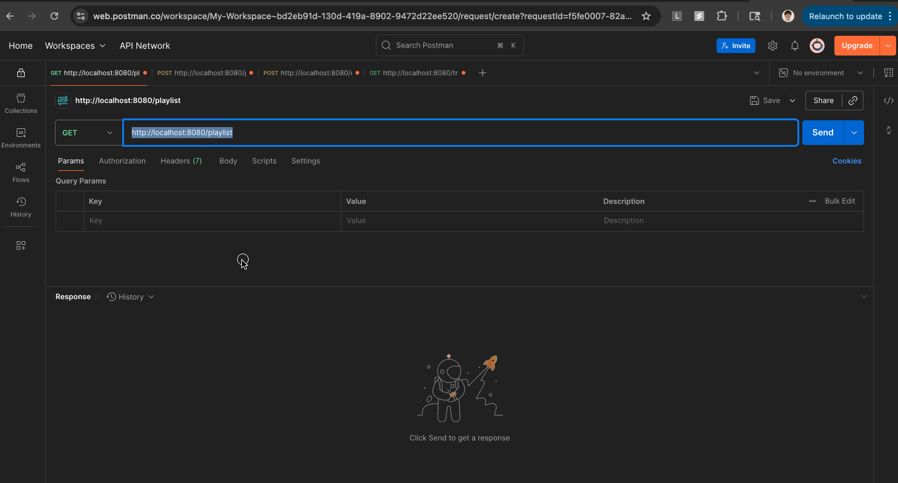

# 🎧 Mixtape API — A Go Backend Built from Scratch

This is a fully custom HTTP web server and RESTful API written from scratch in **Go**, built to deepen my backend engineering skills and explore industry-relevant technologies like **JWT-based authentication**, **REST API design**, and **relational data modeling**.

> 🔧 No frameworks, no generators — just plain Go + HTTP + routing, written manually to understand what’s really happening under the hood.

---

## 🧠 What I Learned

This project helped me:

- Implement real-world **authentication and authorization** using **JWT tokens** — including secure password hashing with `bcrypt`, token generation, validation, and context-based user injection.
- Design and build a **clean REST API** with idiomatic Go using `chi` router and middleware.
- Manage and pass **user identity through request contexts** to protect routes and associate actions (e.g. voting) with the correct user.
- Build a working **in-memory data store** for prototyping, with the project structured to support a smooth migration to PostgreSQL using SQL or an ORM later.
- Think through **relational data modeling** (users, playlists, tracks, votes) to match real backend use cases.
- Practice **clean architecture principles**, keeping authentication logic, route handlers, and models separated and modular.

---

## 🌐 Implemented API Routes

### 🎵 Playlist Routes

- `GET    /playlist` — Get all playlists
- `GET    /playlist/{name}` — Get a specific playlist
- `POST   /playlist` — Create a new playlist
- `POST   /playlist/{name}/tracks` — Add a track to a playlist

### 🔊 Track Routes

- `GET    /tracks/{id}` — Get info on a specific track
- `POST   /tracks/{id}` — Upvote a track

### 👤 User Routes (with JWT Auth)

- `POST   /user/signup` — Create a user account (with password hashing)
- `POST   /user/login` — Log in and receive a **JWT token**
  - JWT is returned in response, and must be included in the `Authorization` header for protected routes.

---

## 📦 Current Architecture Notes

- 🧠 **In-memory database** for now — includes seeded data to test logic via Postman.
- 🧱 Will migrate to **PostgreSQL** in future iterations to support persistence and relational integrity.
- 🔐 Auth is already fully implemented and modular, making DB migration seamless when added.

---

## 🚀 Future Plans

- Migrate to PostgreSQL using either `sqlc` or `gorm`
- Add more granular voting logic (e.g. remove vote, vote limits)
- Write full test suite (unit + integration)
- Deploy via Render/Fly.io with Docker + .env config

---

## 📬 Try It Out

Clone the repo and test routes using Postman or cURL — all core functionality works locally and responds with expected JSON output. If you're a recruiter or engineer reviewing this project, feel free to reach out with feedback or suggestions — I’m always learning and improving.

## 🎥 Demo

